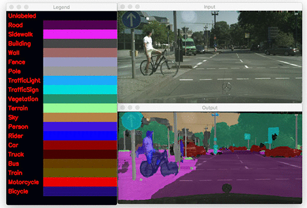

# Custom Semantic Segmentation

Semantic segmentation is a computer vision task where we classify each and every individual pixel in an image into different classes. The classes that can be classified are strictly dependent on what we train our model with.

Demo of semantic segmentation (GIF from [PyImageSearch](https://www.pyimagesearch.com/2018/09/03/semantic-segmentation-with-opencv-and-deep-learning/))

# COCO API Installation
COCO API is used to load the COCO JSON annotation format and create masks if necessary.